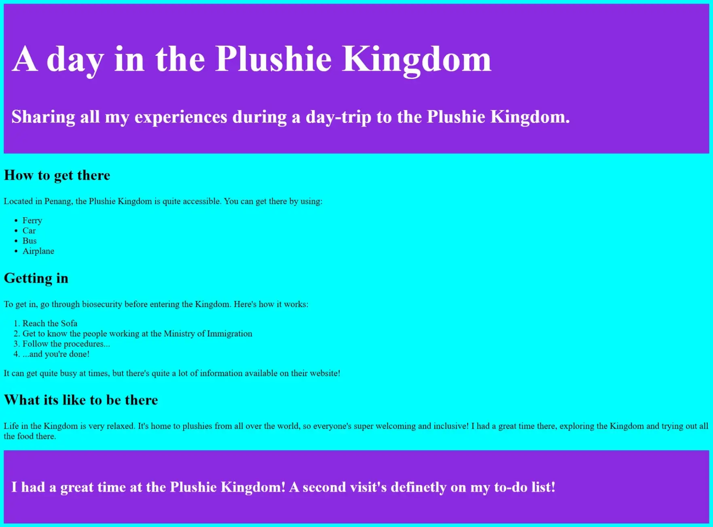

# 01-simple-blog

In the first exercise, you will style a simple blog post using external or internal CSS (If you use external CSS, remember to link the `styles.css` to the `index.html` file. If you use internal CSS, just ignore the `styles.css` file.)

Here's what you need to do:

- give `body` a background colour of `aqua`
- give the divs with the classes `first-section` and `ending` a background colour of `blueviolet` and padding of `1rem`
- make the text inside the `first-section` and `ending` divs white
- give the 'A day in the Plushie Kingdom' text a font-size of `5rem`
- give the 'Sharing all my exp...' text a font-size of `2.5rem`
- give all `h2` elements a font-size of `2rem`
- give all "regular text content" a font-size of 1.2rem
- make the text inside the `ending` class div white and give it a font-size of 2rem

## Outcome image: 

