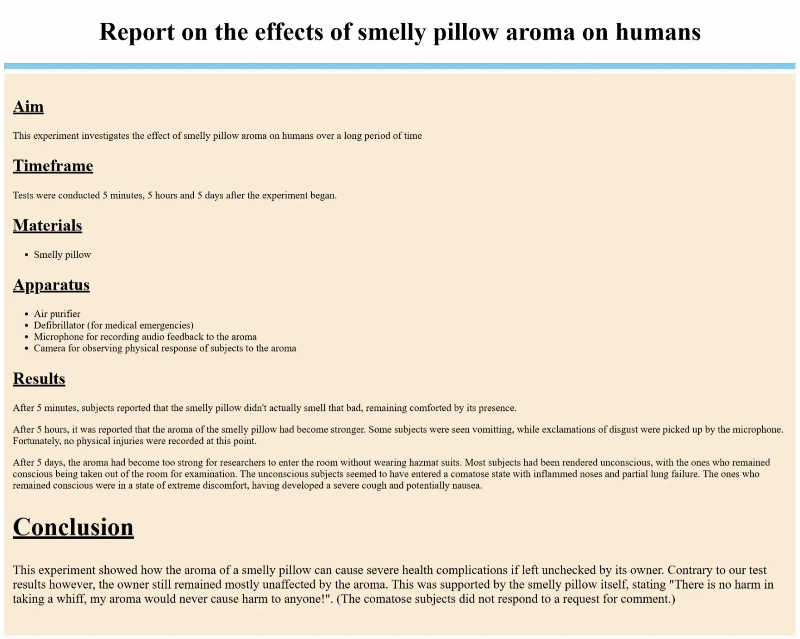

# 02-lab-report

In the second exercise, you will style a lab report using external or internal CSS (If you use external CSS, remember to link the `styles.css` to the `index.html` file. If you use internal CSS, just ignore the `styles.css` file.)

NOTE: Unlike the first exercise, classes and ids are NOT provided, you will have to use your own!

Here's what you need to do:

## Outcome image: 

